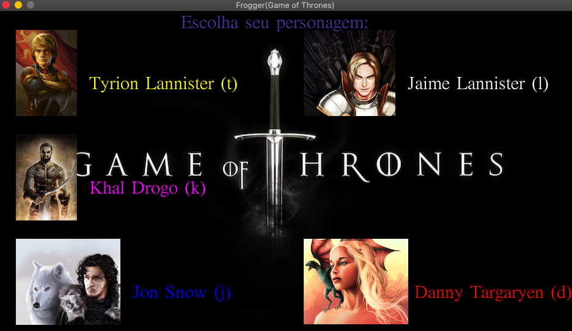
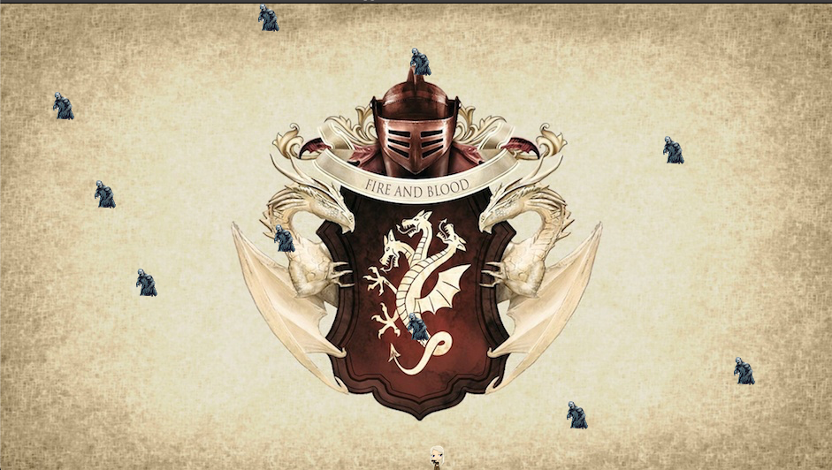
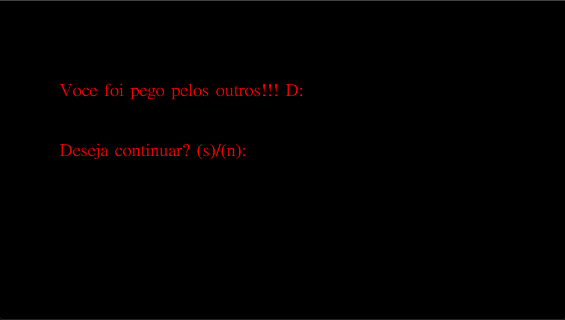

# Frogger (GoT)

This a simple frogger-like game developed as an exercise to coding and software development.
Using the Allegro library and basic concepts of the C programing language, 
this project was developed as an introduction me to the many aspects of programing. 
It contains some simple concepts such as file management, frame refresh rate, input keyboard commands, and others.

## Getting Started

These instructions will get you a copy of the project up and running on your local machine for development and testing purposes. See deployment for notes on how to deploy the project on a live system.

### Prerequisites

To run the game in your local machine, you will need only a C compiler and the [Allegro](https://www.allegro.cc) 
library installed in your computer.

Instructions to install the Allegro library can be found at: [https://www.allegro.cc](https://www.allegro.cc) 

### Compiling and running the game

After the *Allegro* library is installed, clone the repository to your local machine. Open the *Terminal* (MacOS)
or the *Command Prompt* (Windows) at the cloned folder and run the following command:

```
gcc -o frogger main.c -lallegro -lallegro_main -lallegro_image -lallegro_font -lallegro_ttf -lallegro_primitives -lallegro_audio -lallegro_acodec
```

This should generate a compiled file of your game with the name ``frogger``.
Now simply run the compiled game by running the following command in the command line.

For MacOS:
```
./frogger
```

and for Windows:
```
frogger
```

It should be noted that, although these steps should work on any platform, this program was tested on MacOS only.


## Authors

* **Arthur de Senna Rocha** - [asrocha95](https://github.com/asrocha95)

# How to play

## Choosing your character

As soon as you start the game, you should be directed to a character selection screen. You will have five different possible playable characters to choose from. Simple press the letter that is to the right of your chosen character's name and the game will start.



## Playing the game

After choosing your character, the game will start. The playable character will be at the bottom of the screen and there should be ten zombies running horizontally at random speeds throughout the rest of the screen. 



The objective of the game is to get your character to the top of the screen without colliding with any zombies. You can use both the WASD keys or the arrow keys of your keyboard to control your character.

Should you manage to get to the top, you will move to the next level, where the average speed of the zombies will have increased slightly.



